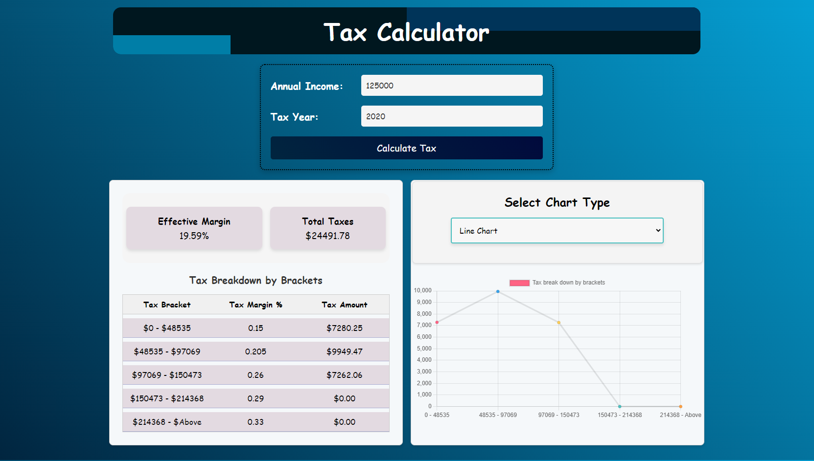

# Getting Started with Tax Calculator Application

This project was bootstrapped with [Create React App](https://github.com/facebook/create-react-app).

### Installation

Step by step instructions on how to install and utilize the application.

#### Clone the repository using below URL

git clone https://github.com/MohanVarma1965/PlusGrade_React.git

#### Navigate to project directory

cd PlusGrade_React

#### Install Dependencies

npm install

#### Start the development server

npm start

#### To run the unit test cases

npm test

#### To setup API locally

In order to run the API locally, please follow these instructions:

docker pull ptsdocker16/interview-test-server
docker run --init -p 5000:5000 -it ptsdocker16/interview-test-server

#### npm start command opens the application directly in

http://localhost:3000

## Available Scripts

In the project directory, you can run:

### `npm start`

Runs the app in the development mode.\
Open [http://localhost:3000](http://localhost:3000) to view it in the browser.

### Need to pull and run the Docer image to access the API

In order to run the API locally, please follow these instructions:

docker pull ptsdocker16/interview-test-server
docker run --init -p 5000:5000 -it ptsdocker16/interview-test-server

Navigate to http://localhost:5000. You should be greeted with this set of instructions, and access to the different available endpoints. The following are the relevant endpoints:

### Appplication Details

The Tax Calculator is an interactive single-page application that showcases annual tax rates for the years 2019 through 2022. It's designed for adaptability, making sure it transitions smoothly across different screen dimensions.

### Landing Page

Here, users are presented with fields to input their Annual Income and choose the relevant Tax Year. After making these selections, they can proceed by clicking the "Calculate Tax" button.

### Results Page - Large Screen

Upon providing the Annual Income and Tax Year details, the application showcases the Effective Margin, Total Taxes, and a comparative chart. While a Bar Chart is displayed by default, users also have the option to switch to a Line Chart.

### Results Page - Small screen

The design is adaptive. When viewed on devices with smaller screens, the layout adjusts for the best user experience.

### Results page - Line Chart

### Loading Indicator for Ongoing Tasks

When the user has a task that's still pending, the application displays a loading spinner to enhance user interaction.

### Server Response Failure

Should the application fail to obtain a response, it provides error notifications to inform the user.

### Delayed Server Response

If the application doesn't receive a response within the defined timeout period, it triggers a distinct error notification. Currently, the application waits for 6 seconds before the promise gets rejected.

