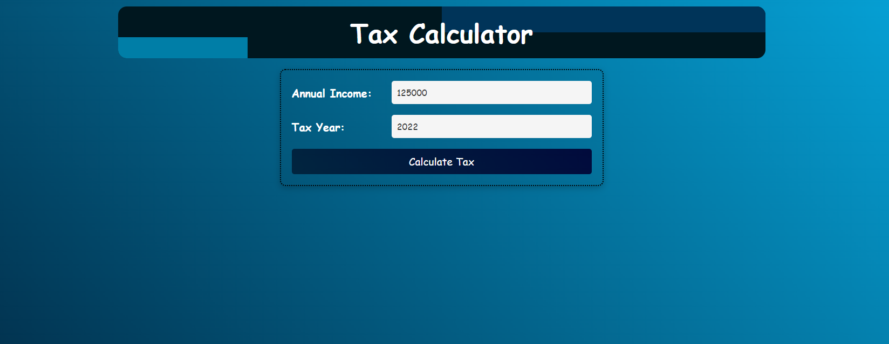

# Getting Started with Tax Calculator Application

This project was bootstrapped with [Create React App](https://github.com/facebook/create-react-app).

## Available Scripts

In the project directory, you can run:

### `npm start`

Runs the app in the development mode.\
Open [http://localhost:3000](http://localhost:3000) to view it in the browser.

The page will reload if you make edits.\
You will also see any lint errors in the console.

### `npm test`

Launches the test runner in the interactive watch mode.\
See the section about [running tests](https://facebook.github.io/create-react-app/docs/running-tests) for more information.

### `npm run build`

Builds the app for production to the `build` folder.\
It correctly bundles React in production mode and optimizes the build for the best performance.

The build is minified and the filenames include the hashes.\
Your app is ready to be deployed!

See the section about [deployment](https://facebook.github.io/create-react-app/docs/deployment) for more information.

### Appplication Details

The Tax Calculator is an interactive single-page application that showcases annual tax rates for the years 2019 through 2022. It's designed for adaptability, making sure it transitions smoothly across different screen dimensions.

### Landing Page

Here, users are presented with fields to input their Annual Income and choose the relevant Tax Year. After making these selections, they can proceed by clicking the "Calculate Tax" button.

Upon providing the Annual Income and Tax Year details, the application showcases the Effective Margin, Total Taxes, and a comparative chart. While a Bar Chart is displayed by default, users also have the option to switch to a Line Chart.

The design is adaptive. When viewed on devices with smaller screens, the layout adjusts for the best user experience.

